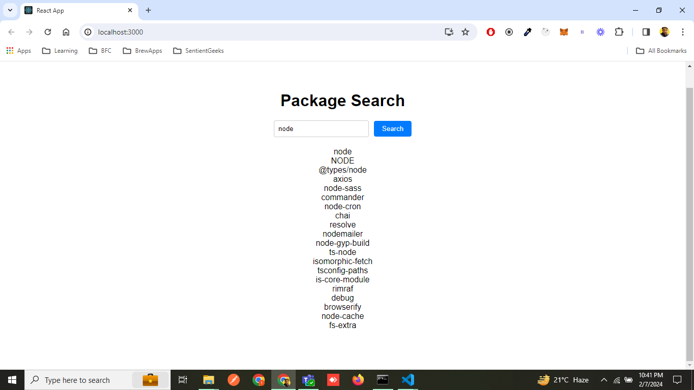

# React + Redux TypeScript Practice Project

This is a practice project for implementing React with Redux and TypeScript. The project utilizes the npm API to search for packages based on user input. It features a simple interface with a textbox for entering search queries and a button to trigger the search. The search results are fetched using Axios and stored in the Redux store using Redux Thunk for asynchronous actions.

## Screenshots

### Before Fetching Data


### After Fetching Data


## Getting Started

To get a local copy up and running, follow these steps:

1. Clone the repository
   ```sh
   git clone https://github.com/DebadritaGhosh/typescript-with-redux-practice-project
   ```
2. Navigate into the project directory
   ```sh
   cd react-redux-typescript-practice
   ```
3. Install dependencies
   ```sh
   npm install
   ```
4. Start the development server
   ```sh
   npm start
   ```

## Usage

Once the development server is running, open your browser and navigate to `http://localhost:3000`. You should see the project interface. Enter a search query into the textbox and click the search button to fetch matching npm packages.

## Technologies Used

- React
- Redux
- TypeScript
- Axios

## Acknowledgements

- [Stephen Grider] : `https://www.udemy.com/course/react-and-typescript-build-a-portfolio-project/`

---